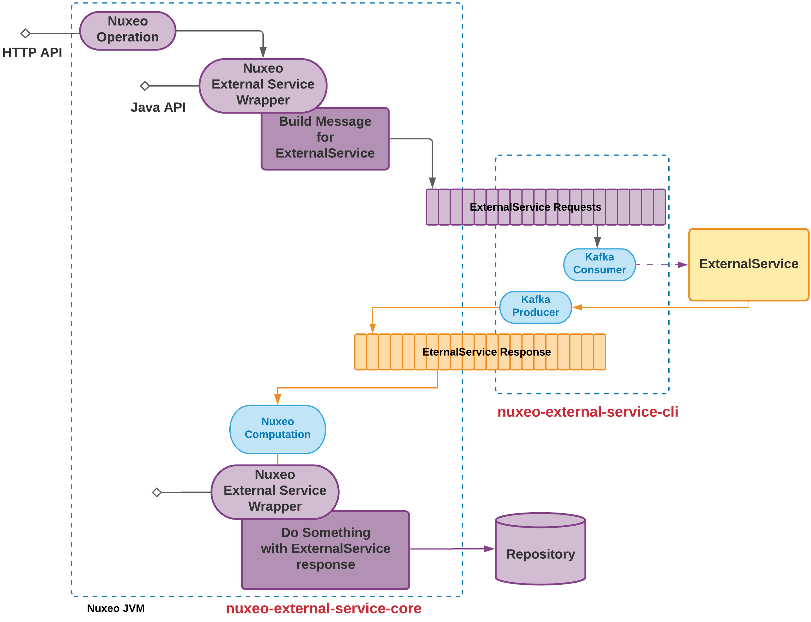

# nuxeo-external-service-sample

## About

This repository contains a sample code to manage comunication between a Nuxeo Server and an external service using `nuxeo-stream` (Kafka).

## Principles

## Sub Modules

## Build

Simply run the maven build:

    mvn clean install

